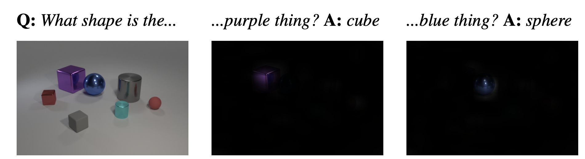
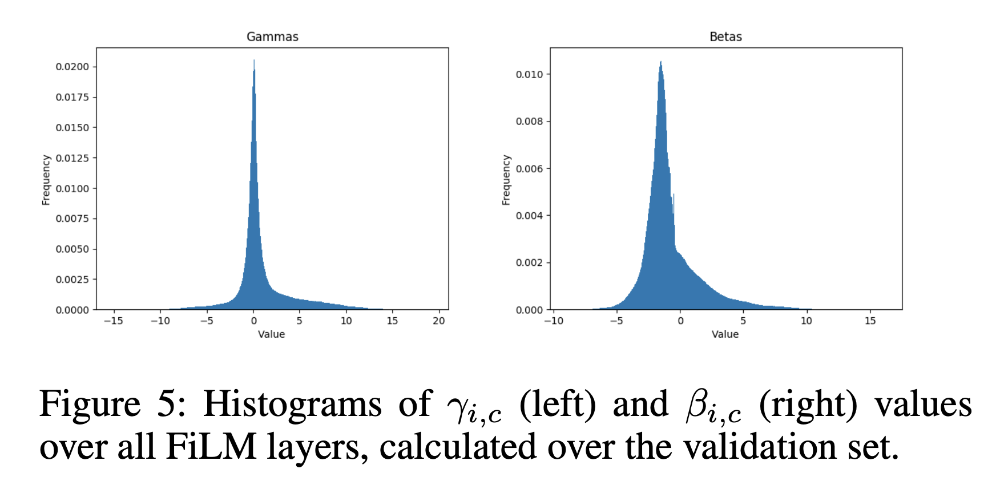

# FiLM: Visual Reasoning with a General Conditioning Layer

[Link to paper](https://arxiv.org/abs/1709.07871)

## My Notes

- Applications to multi-goal RL:
  - Can condition the feature map transformations on some task, may be the angle of rotation desired or some one-hot encoding.
  - Can use the transformed vision network to output different probabilities for images given different input goals. Works for a vision based RL system.

## 1. Introduction

- (General) method for conditioning on data, this paper tests the method on CLEVR (which is an image-based question and answer dataset)
- Overview of the FiLM method (used for visual reasoning): applies a FiLM layer to the CNN pipeline, conditioned on the input data, which is the question text in this case, allowing for different feature maps to be used to answer different questions.

## 2. Method

- Learns functions *f*, *h*, to output a scaling and a bias term, as functions of *x*, the conditioning data, represented by neural networks.
  - $$\gamma_{i, c} = f_c(x_i)$$
  - $$\beta_{i, c} = h_c(x_i)$$
  - *i* corresponds to the *i*th input entry (ex: the ith pixel), and *c* corresponds to the *c*th feature/feature mapping
  - These scalars can be applied as an **affine transformation** to the **activations of a neural network**: $$FiLM(F_{i, c} | \gamma_{i, c}, \beta_{i, c}) = \gamma_{i, c} * F_{i, c} + \beta_{i, c}$$
- Practically, these two networks are combined into one $$g_c(x_i)$$, which outputs a vector of both gamma and beta. One network sharing weights to learn these two parameters has benefits to the speed of learning.
- FiLM only needs 2 parameters for a given feature map, which means that the computational/size cost does not scale with the image resolution.
- Model:
  - Processes the question $$x_i$$ through a Gated Recurrent Unit (GRU), with the final hidden state being  question embedding.
    - **Question:** How does the GRU work? Does it split up for each word?
  - For each of *n* residual blocks, the question embedding is used to generate the two parameters gamma and beta, which are passed into the ResBlock.
    - **Question:** What's the purpose of the residual block? Look this up.
  - The ResBlock outputs now feed into the image pipeline, which consists of 2D convolutional layers in addition to the FiLM layers with parameters from the previous part. These convolutional layers are combined and passed into a MLP classifier that determines the answer from 28 possible answers.
    - *Important:* only part where the question is being used is to find the parameters of the FiLM layers.

## 3. Related Work

- Conditional Normalization methods (FiLM is a generalized version of this)
- Conditional DCGANS

## 4. Experiments

- Comparisons against several baseline methods on the CLEVR dataset:
  - Q-type baseline: predicts answer based on question category
  - LSTM: predicts using only the question
  - CNN+LSTM: pass in extracted image/question features from CNN/LSTM, then pass into a MLP
  - Stacked Attention Networks: similar to above, except with features combined w/ spatial attention
  - End-to-End Module Networks and Program Generator + Execution Engine: separate neural networks learn sub-functions and are assembled together depending on the question
  - Relation networks
- FiLM produces better results than these baselines, and is able to be trained on both raw pixel data and an image features model. Low-level questions seem to work better on the raw pixel models. High-level questions better on the feature model.

### What do FiLM layers learn?

- Below shows an example of activation regions used by the MLP to make the classification, which corresponds directly to the question the CNN layers were conditioned on.
  - 
- Below show parameter histograms of gamma and beta. Some things to note: (1) g**amma values peak at value 0**, suggesting that the **FiLM layers often learn to throw out some features/suppress entire feature maps**. (2) A large portion of the **gamma and beta values are negative**, which **changes which features make it through the ReLU** thresholding that happens right after the FiLM layer.
  - 

- Ablation study is performed to see the effect of the different params, some key summaries:
  - Gamma (scaling) seems to be used more in conditioning/have more of an effect on the accuracy.
  - Normalization not needed that badly, performance without is still comparable.
  - Few FiLM layers works almost as well (even down to 1). How much conditioning is actually needed?
- The FiLM model is also tested on CLEVR-Humans, which is a more difficult dataset than the above, outperforms other methods.