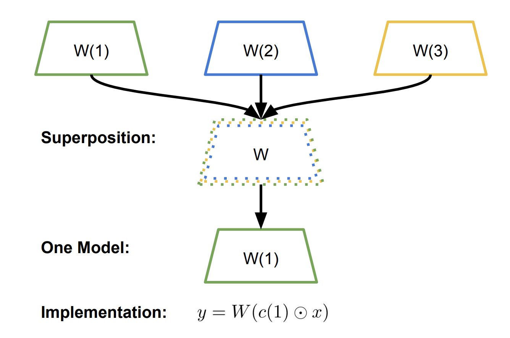
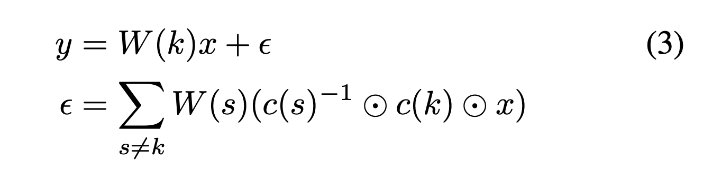
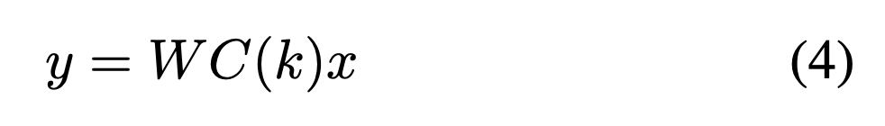
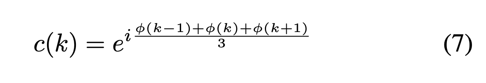
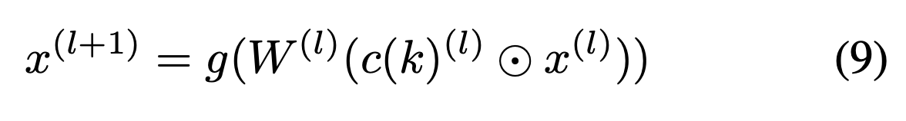
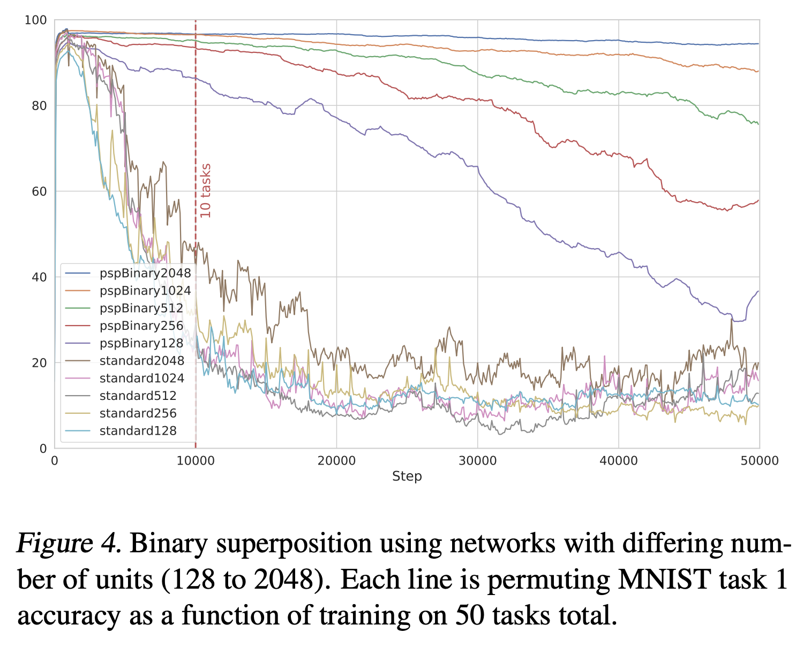

# Superposition of many models into one

[Link to the paper](https://arxiv.org/pdf/1902.05522.pdf)

Brian Cheung, Alex Terekhov, Yubei Chen, Pulkit Agrawal, Bruno Olshausen 

## Summary

## 1. Introduction

- Currently, we have individual networks specialized in one task (ex: vision/speech/text). We want one model that's able to do all three. This is the idea of a *"connectionist model",* which proposes that the brian has a *associative memory* for different situations/contexts.

- The paper proposes a method to combine multiple models into one *superposition of models*. It accomplishes this by storing linear transformations as memory, and recalling linear transformations with a context vector.

- Benefits of doing this may include (1) reducing interference during training among the different tasks and (2) allowing more online learning methods.

  

## 3. Motivation

- The capacity of neural networks has not been utilized fully. Some reasons why this might be the case: parameters of a neural network can be "drastically compressed after training."
- Many trained parameters can be pruned. Pruning mask can be applied before training with no adverse impact on learning. Intrinsic dimensionality of most tasks is a small fraction of the dimensionality of the parameters.
  - **Question:** what does "intrinsic dimensionality of a task" actually mean? How do we know that tasks can be represented by a small fraction of the network's capacity? To find out, probably you can decrease the size of the network, and if the task is still learned, then it has a "lower intrinsic dimensionality."

### Online learning

- Requires a large dataset of labelled examples
- Small batches of data sampled to evaluate the loss function and update params
- Need to sample data uniformly at random to ensure that training data is i.i.d
- Attempts to help solve this in the past have included: replay buffers in RL, separate networks for separate tasks, or heuristics to select which weights can be changed during training.

## 4. Parameter Superposition

- The equation below recovers the linear transformation $$W(k)x$$, with a residual $$\epsilon$$, which is the summation of all terms interfering destructively with the context $$c(k)$$.
  - 
- Different kinds of superposition: (1) complex superposition, (2) binary superposition, (3) rotational superposition
  - Complex and binary superposition are special cases of rotational superposition.
  - 
  - The above is a generalized form of the binding operation (of the context). The $$C(k)$$ right multiplies parameters $$W$$, which can be seen as a rotation by the $$C \in \R^{M \times M}$$ orthogonal matrix for each row of $$W$$. 

## 5. From superposition to composition

- Generate contexts over superposition keys $$k \in S$$ by applying some defined operation over existing contexts. Two possible compositions:
  - Mixture of contexts
    - In complex superposition, the phase $$\phi$$ can be used to generate a mixture of contexts as follows (averageing the previous, current, and next context):
      - 
      - **Question:** why is the phase a valid context? What does this actually mean, and what is it the phase of? Seems like the phase is "sampled with uniform probability density" from some distribution. Why does it not matter what the phases are?
  - Powers of a single context
    - Create new contexts by taking powers of a single context vector. Allows for passing the context in with a single value.

## 6. Neural Network Superposition

- Modify the forward propagation by performing the linear transformation of the weights of each layer with respect to the context.
  - 

## 7. Experiments

- *Catastrophic interference/forgetting*: "learning interference occurs when the distribution of training data shifts during training… A network trained on multiple consecutive tasks will suddenly 'forget' or perform poorly on earlier tasks. This can be considered a form of overfitting where the model temporally overfits to the data it is currently presented, generalizing poorly to data at other timepoints."
- Results show improvment in the network's capacity to handle more tasks (in the permuting MNIST example). The networks using parameter superposition (PSP) are able to maintain higher accuracies, even when there is **input interference/shifting data distribution.**
  - 
    - **Questions:**
      - (1) What exactly is a "task" in this case?
      - (2) Each task is given 1000 steps, but how is each task introduced while training the network? One at a time (per 1000 steps) or altogether and having tasks sampled randomly?
- Also tested with **output interference, which is a shift in the label distribution of the training data,** found a much smaller decrease in performance compared to a standard network.