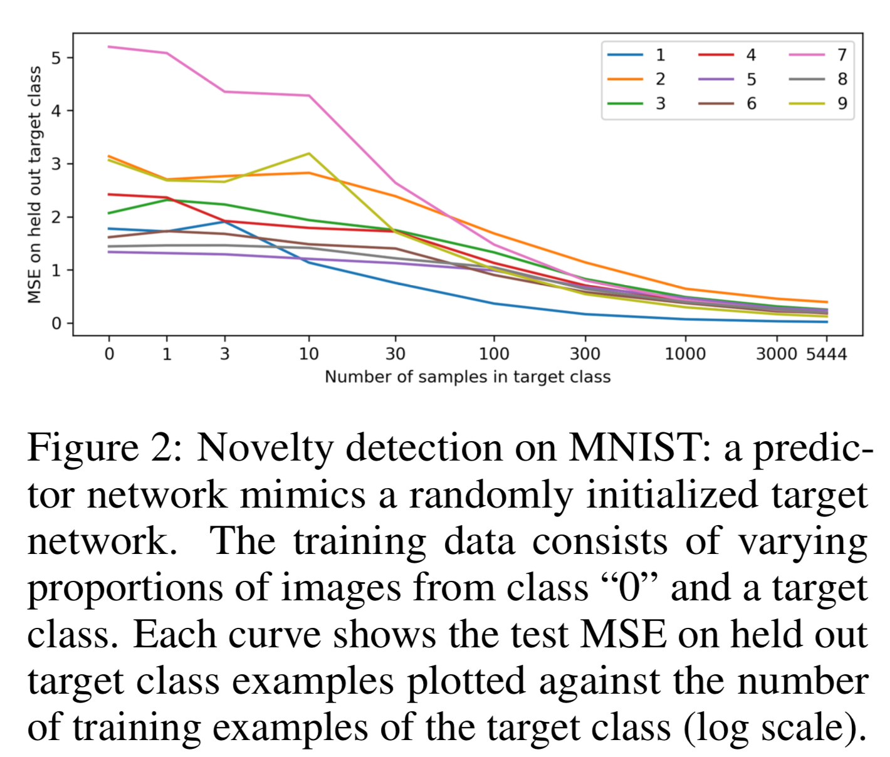

# Exploration by Random Network Distillation (RND)

[Link to paper](https://arxiv.org/abs/1810.12894)

## 1. Introduction

- Other exploration methods (counts, pseudo-counts, information gain, prediction gain) are hard to scale to many parallel environments (What exactly does this mean? More computation required/things to keep track of?)
  - What are other prediction gain methods?
- RND is simple to implement and is computationally inexpensive (only requires an extra forward pass in a neural network)
  - Many agents that maximize prediction errors run into the problem of **gravitating toward stochastic states/actions**
    - **Prediction errors:** using the observation that a classifier's prediction error on a novel state is large compared to states that have been seen before
    - Stochastic states/actions provide large prediction errors, even though the predictions may be correct in expectation

## 2. Method

### 2.1 Exploration Bonuses

- Encourages an agent to explore by adding the environment reward $$e_t$$ with $$r_t = e_t + i_t$$, adding on the exploration bonus at time t
  - Examples: inverse/root inverse of visitation count, prediction error related to the agent's transitions (ex: predicting forward dynamics, inverse dynamics, "prediction errors tend to decrease as the agent collects more experience similar to the current one")

## 2.2 RND

- 2 neural networks

  - **Fixed and randomly initialized target network** that sets the prediction problem ($$f: O \rightarrow \R^k$$)
  - **Predictor network** trained on data collected by the agent ($$\hat{f}: O \rightarrow \R^k$$)
  - Both networks take the observation to some k-dimensional space

- The predictor network is trained via gradient descent on the MSE regression loss between the target network output and its own output

  - $$||\hat{f(x; \theta)} - f(x)||^2$$

- Example of how this is used as a predictive error exploration bonus:

  - MNIST, where there is a dataset comprising of images of 0's as well as digits of a target class
  - Changing the number of target class observations seen in the original training set (where the target class can be thought of as the "novel data") decreases the MSE on the held out set of target class observations
  - Intuition: if a certain observation has been seen more in the training dataset, then the predictor output will have lower error
  

### 2.2.1 Source of Prediction Errors

- What contributes to prediction error?
  - **Amount of training data**: fewer examples are seen; therefore, error on these states is higher
  - **Stochasticity:** prediction error is high because the environment/target function is stochastic (think of a coin flip, dice roll, where predicting the correct expectation gives high prediction error)
  - **Model misspecification:** prediction error is high because the target function is too complex to fit to 
  - **Learning dynamics:** optimization process fails to find a predictor in the model class that matches the target network
- 