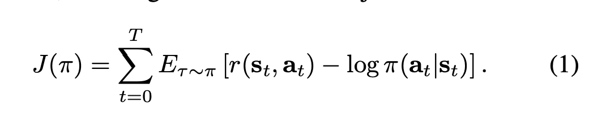

# End-to-End Robotic Reinforcement Learning without Reward Engineering

[Link to paper](https://arxiv.org/pdf/1904.07854.pdf)

## 1. Introduction

- Reward instrumentation is difficult and defeats the purpose of an end-to-end reinforcement learning system
  - Wrongly defined rewards can easily lead to wrong behavior
  - Using an end-to-end reinforcement learning algorithm from pixels doesn't make sense when the reward is still instrumented
- Naive methods such as using the success probabilities of a goal classifier can be "easily exploited by a reinforcement learning algorithm," since the policy can "visit parts of the observation space that the classifier was not trained on, cuasing it to output incorrect probabilities."
- Inverse reinforcement learning solves the problem by inferring a reward function based on expert trajectories. Problems with this include:
  - Awkward to provide these expert demonstrations sometimes (teleoperating, controlling the robot's movements)
  - Shows "how" the task should be done, which is different from the robot learning how to do the task on its own
- [VICE]() adversarially mines negative examples from online examples collected by the policy
  - **Note:** Look into adversarial imitation learning techniques
  - Problems with VICE:
    - Requires many goal examples in the beginning
    - Not sample efficient, since it requires on-policy RL for the training of the policy and the classifier (Is this true? You can use an off-policy RL algorithm for the policy, only the classifier needs to receive updates for on-policy data.)

- **Contribution of this paper:**
  - **Learning robotics skills with high dimensional image observations without reward instrumentation, with low sample complexity and human goal collection required (by utilizing a decent number of semi-supervised active goal queries during training)**.

## 2. Related Work

- Asking for binary feedback in the form of "human preferences"
  - **Note:** Look into how this is done, what kind of feedback is given?
- Daniel et al. proposes an active query strategy that asks for a numerical score, whereas this paper only asks for a binary success/failure query
- VICE requires many goal examples in the beginning, upwards of 50k
  - **Question:** I have only been using ~50-100, since the goal positions are not that varied. What's the use of adding so many goal examples?

## 3. Preliminaries

- Maximum entropy RL
  - 
  - Optimizing with respect to the above cost function maximizes the sum of rewards as well as the entropy of the policy

