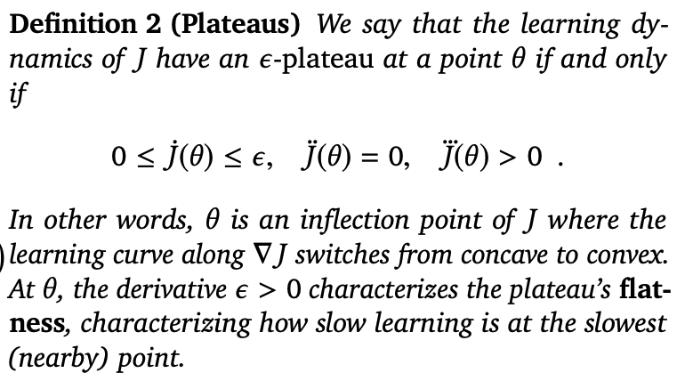

# Ray Interference: a Source of Plateaus in Deep RL

[Link to the paper](https://arxiv.org/pdf/1904.11455.pdf)

Tom Schaul, Diana Borsa, Joseph Modayil, and Razvan Pascanu 

## Summary

- Problem with RL algorithms: learning and data generation are coupled, so in the process of learning, agents will determine the distribution of states visited. The "future" data distribution is stored in the replay buffer: a moving target problem.
- 

## 1. Introduction

- Compared to supervised learning (SL), RL algorithms have unstable/high variance learning dynamics, since they "operate on highly non-stationary data distributions that are coupled with the agent's performance." An agent needs to intentionally explore a lot in order to get good training data.
- Focus on the case of mulitple components in learning objective (i.e. multitask RL).
  - Problem: different components do not "coordinate" and will interfere with each other.
- "**Ray interference**: a learning system suffers from plateaus if it has (a) negative interference between the components of its objective, and (b) coupled performance and learning progress."
  - Example of (a): negative interference when learning many different tasks in multitask RL.
  - Example of (b): On-policy RL, generates future data from the policy that will learn using it.

## 2. Minimal, explicit setting

- (K x n)-bandit problem: deterministic contextual bandit with K contexts and n discrete actions.
  - [Contextual bandits problem](https://www.youtube.com/watch?v=N5x48g2sp8M)
    - Agent observes a context s_t at time t. Agent selects action a_t from {1, 2, …, n}. Then receives a reward r(s_t, a_t). Goal is to maximize the reward for all timesteps from 1 to horizon T.
    - Policy: rule for selecting actions from the context. Function from s_t to a_t, can be parameterized by some network with weights theta.
  - Reward function is the indicator function which equals 1 when the action matches the context (k=a), 0 otherwise.
  - Policy: softmax pi(a | s_k) of the logits (l_a,k = log probability prediction of the context k to action a).
  - Expected performance: J = sum over all contexts pi(k | s_k). The other terms go away because the reward is only non-zero when k=a. Train network that predicts logits using policy gradient.
  - l = Ws+b (W is n x K, b is n x 1, s is a one-hot vector selecting a row of W). No sharing of the components in W, but b is shared.
- Different types of interference:
  - 
    
    - Cosine distance/similarity between the gradients of each component (task).
    - "Positive transfer" is beneficial sharing of weights
  - 
   
   - Solution reaches a saddle point, making learning much slower
  - 
    
    - WTA where a gradient step only increases one component and decreases/doesn't affect the others is a "basin of attraction" toward a saddle point

## 3. Generalizations

### Higher Dimensional Bandit Problems

- 

    - Above shows the contextual bandits problem increased to higher dimensions.
    - Shows that as the number of tasks/components increases, the time it takes to overcome each hurdle increases exponentially. 2 hypotheses as to why this happens:
    - (1) For the last two components learned, they have been suppressed by interference for all stages of the learning curve up to that point. **Thus, all this negative transfer causes their performance to be worse to much worse than initially, causing learning to be slower later on.**
    - (2) Length of the plateau may have something to do with the previously learned K-1 tasks. **Starting to learn the Kth task will cause a "tug-of-war" with the previous K-1 tasks**, where the **K-1 tasks will try to adjust the weights back to where they were performing optimally**, leads to: "Only changes in null-space of K-1 tasks are preserved". **Restricting the optimization, which takes longer.**

### RL

- Settings in which the decomposition of the learning task into multiple components may be subject to interference. These settings do not have to have explicit decomposition. Learned policies may be a result of a combination of skills transferred between "subtasks."
- Coupling of data distribution and policy may be more prevalent in RL, since the agent will visit some parts of the state space more than others, causing the policy to prefer to stay in these regions where reward is present. Determines the data distribution.
  - On-policy vs. off-policy learning. Off-policy algorithms reduce coupling in learning dynamics.
- Multitask vs. continual learning
  - *Task dominance:* learning one task at a time. Above analysis suggests reasons why this may happen.
  - Continual/lifelong learning is hard, because the neural network might prematurely reach its representative capacity, with it being hard to move the weights significantly to approach a better solution for new data coming in. (Ex: tug-of-war learning dynamics.)

## 4. Discussion

- How prevalent?
  - Some multi-task RL setups do not suffer from visible plateaus (IMPALA paper)
- How to detect?
  - If components of the total reward (rewards for each subtask) are known, can track the progress of learning over time.
  - If not known, first check for plateaus in the learning curve of individual runs.
    - **Potential fixes: change the network architecture, fix the data distribution (distillation), learning more off-policy.**
- What makes it worse?
  - **Sampling tasks/contexts based on recent learning progress (non-uniformally). This amplifies the WTA effect.**
  - Bootstrapping might introduce coupling. **Values improve faster in regions that have more accurate bootstrap targets.** (Ex: Using a value function as the target.)
  - The task that the policy learns fastest might dominate other tasks.
- What makes it better?
  - 3 approaches:
    - (1) Reduce interference: 
      - Multi-head architectures (feed in the context/task at different layers of the neural network)
      - Gating/attention mechanisms
    - (2) Reduce coupling:
      - Off policy learning
      - Rebalancing the data distribution with prioritized replay/fitenss sharing/reward shaping to make the signal less sparse. (Smoother learning dynamics? One region does not immediately spike in probability as much.)
      - Policy distillation
    - (3) Tackle head-on:
      - Continual learning techniques
